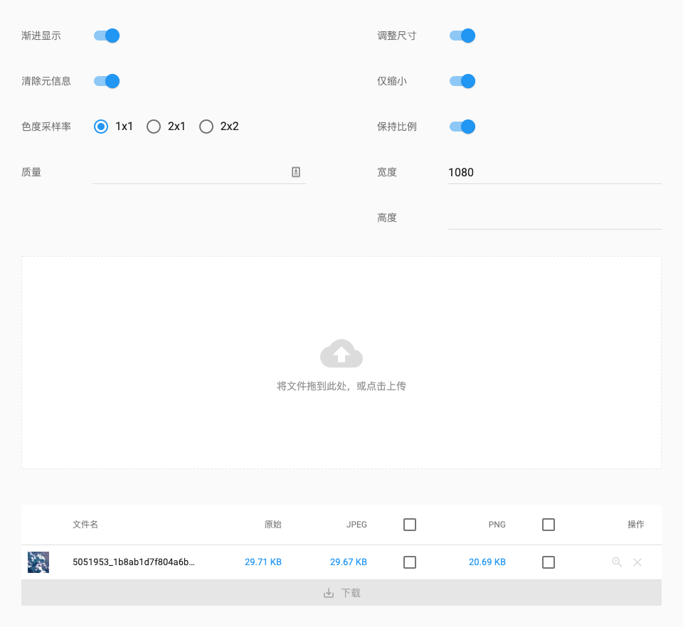

 Imgminify

> An online image optimizer



## Features

- Creating progressive image (JPEG only)
- Removimg metadata
- Chroma downsampling (JPEG only)
- Quality Adjustment
- Size Adjustment

## Getting started

First download and install [ImageMagick](http://www.imagemagick.org/) & [pngquant](https://pngquant.org)

then install packages
```bash
yarn
```

for develop
```bash
yarn run dev
```

for product
```bash
# build client
yarn run build

# start server
yarn start
```
